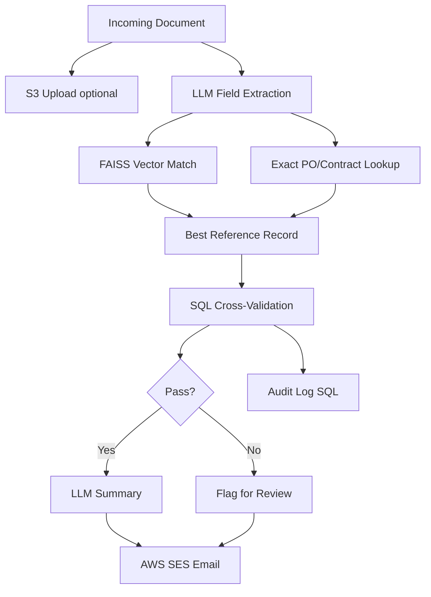

# GenAI Document Matching & Summary Extraction

> **Resume Project 2** — Intelligent pipeline to match finance documents (invoices, contracts, POs) against reference records using Azure OpenAI embeddings, FAISS, LLM extraction, AWS S3/SES, and SQL Server validation.

---

## Table of Contents

1. [Overview](#overview)
2. [Business Problem](#business-problem)
3. [Architecture](#architecture)
4. [Tech Stack](#tech-stack)
5. [Project Structure](#project-structure)
6. [Installation](#installation)
7. [Configuration](#configuration)
8. [Running the Pipeline](#running-the-pipeline)
9. [Pipeline Stages](#pipeline-stages)
10. [Sample Input/Output](#sample-inputoutput)
11. [Database & Audit Log](#database--audit-log)
12. [AWS Integration](#aws-integration)
13. [Testing](#testing)
14. [Troubleshooting](#troubleshooting)

---

## Overview

This pipeline automates **finance document intelligence**:

- **Extracts** structured fields from unstructured documents (vendor, invoice #, PO, amount, due date, cost center)
- **Matches** incoming docs to reference records via semantic vector search + exact ID lookup
- **Validates** LLM extractions against SQL Server PO register and vendor master
- **Generates** structured summaries for matched document pairs
- **Delivers** results via AWS SES; maintains full audit log in SQL Server

Supported formats: `.txt`, `.pdf`, `.docx`

---

## Business Problem

Manual invoice-to-PO matching during monthly close is error-prone and slow.

| Step | Manual Process | Automated Pipeline |
|------|----------------|-------------------|
| Read document | Analyst reads PDF | LLM field extraction |
| Find matching PO | Search ERP | FAISS + exact ID match |
| Validate amounts | Eyeball compare | SQL cross-validation |
| Write summary | Email manually | LLM summary + SES |
| Audit trail | Spreadsheet | SQL audit log |

---

## Architecture



---

## Tech Stack

| Component | Technology |
|-----------|------------|
| LLM | Azure OpenAI GPT-4 |
| Embeddings | Azure OpenAI ada-002 |
| Vector Search | FAISS |
| Database | SQL Server / SQLite |
| Storage | AWS S3 |
| Notifications | AWS SES |
| Parsing | pypdf, python-docx |

---

## Project Structure

```
document-matching-extraction/
├── README.md
├── requirements.txt
├── .env.example
├── data/
│   ├── incoming_documents/      # Documents to process
│   ├── reference_records/       # reference_master.csv
│   └── faiss_index/             # Built vector index
├── src/
│   ├── main.py
│   ├── config.py
│   ├── database.py
│   ├── extraction/
│   │   ├── llm_extractor.py     # GPT-4 / rule-based extraction
│   │   └── prompts.py
│   ├── matching/vector_matcher.py # FAISS + exact match
│   ├── validation/cross_validator.py
│   ├── summary/summary_generator.py
│   ├── notifications/ses_notifier.py
│   └── pipeline/orchestrator.py
└── tests/test_pipeline.py
```

---

## Installation

```powershell
cd document-matching-extraction
python -m venv .venv
.\.venv\Scripts\Activate.ps1
pip install -r requirements.txt
copy .env.example .env
```

---

## Configuration

| Variable | Description |
|----------|-------------|
| `AZURE_OPENAI_*` | GPT-4 + embedding deployments |
| `DB_ENGINE` | `sqlite` or `mssql` |
| `S3_BUCKET` | Document storage bucket |
| `S3_INCOMING_PREFIX` | S3 key prefix |
| `SES_SENDER` / `SES_RECIPIENTS` | Email delivery |
| `CONFIDENCE_THRESHOLD` | Match confidence cutoff (default 0.75) |
| `FAISS_INDEX_PATH` | Vector index location |

---

## Running the Pipeline

```powershell
python -m src.main
```

Place documents in `data/incoming_documents/` and run. JSON results print to stdout.

### Process Single File (Python)

```python
from pathlib import Path
from src.pipeline.orchestrator import DocumentPipeline

pipeline = DocumentPipeline()
result = pipeline.process_file(Path("data/incoming_documents/invoice_acme_4421.txt"))
print(result.model_dump_json(indent=2))
```

---

## Pipeline Stages

### 1. LLM Field Extraction

Prompts extract: `vendor`, `invoice_number`, `po_number`, `contract_id`, `amount`, `due_date`, `cost_center`, `document_type`, `confidence`

Fallback: rule-based regex extraction when Azure OpenAI not configured.

### 2. Vector Matching

- **Exact match** on PO/contract/invoice ID (priority)
- **FAISS semantic search** over reference record embeddings
- Similarity score compared to `CONFIDENCE_THRESHOLD`

### 3. SQL Cross-Validation

Checks:
- Vendor name vs vendor master
- Amount vs PO register
- Cost center consistency
- Extraction confidence threshold

### 4. Summary Generation

LLM (or template) produces ops-ready summary: key terms, value differences, open items.

### 5. Delivery & Audit

- Upload source doc to S3
- Send summary via SES
- Log full result in `document_audit_log` table

---

## Sample Input/Output

**Input:** `invoice_acme_4421.txt` — Acme Supplies invoice for $12,500, PO-77821

**Output:**
```json
{
  "extracted": {
    "vendor": "Acme Supplies Ltd",
    "po_number": "PO-77821",
    "amount": 12500.0,
    "confidence": 0.82
  },
  "match": {
    "reference_id": "PO-77821",
    "similarity_score": 0.98,
    "matched": true
  },
  "validation": { "passed": true, "mismatches": [] }
}
```

---

## Database & Audit Log

| Table | Purpose |
|-------|---------|
| `vendor_master` | Vendor names + cost centers |
| `po_register` | PO numbers, amounts, due dates |
| `document_audit_log` | Full pipeline results per document |

---

## AWS Integration

| Service | Usage |
|---------|-------|
| **S3** | Archive incoming documents |
| **SES** | Deliver summary emails to finance ops |

Mock mode logs S3/SES actions when AWS credentials not set.

---

## Testing

```powershell
pytest tests/ -v
```

---

## Troubleshooting

| Issue | Fix |
|-------|-----|
| UNIQUE constraint on PO | Delete `data/documents.db` and re-run |
| Match score 0.0 | Exact PO lookup added; rebuild FAISS index |
| Validation REVIEW | Lower threshold or verify reference CSV |
| PDF extraction empty | Ensure pypdf installed; check scanned PDFs |

---
