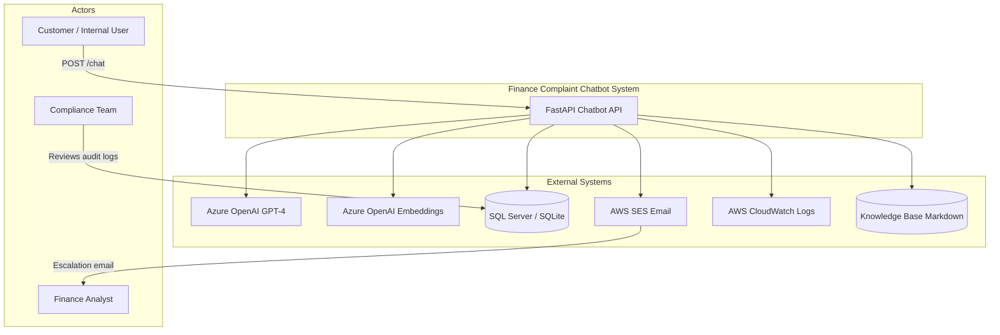
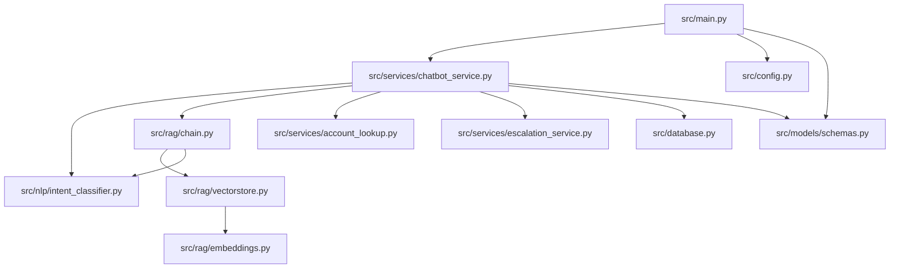
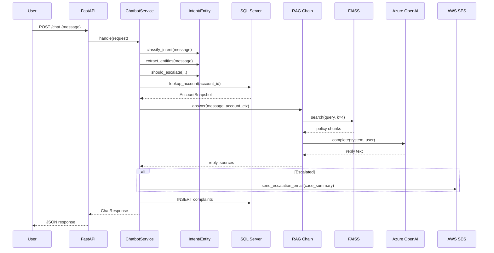
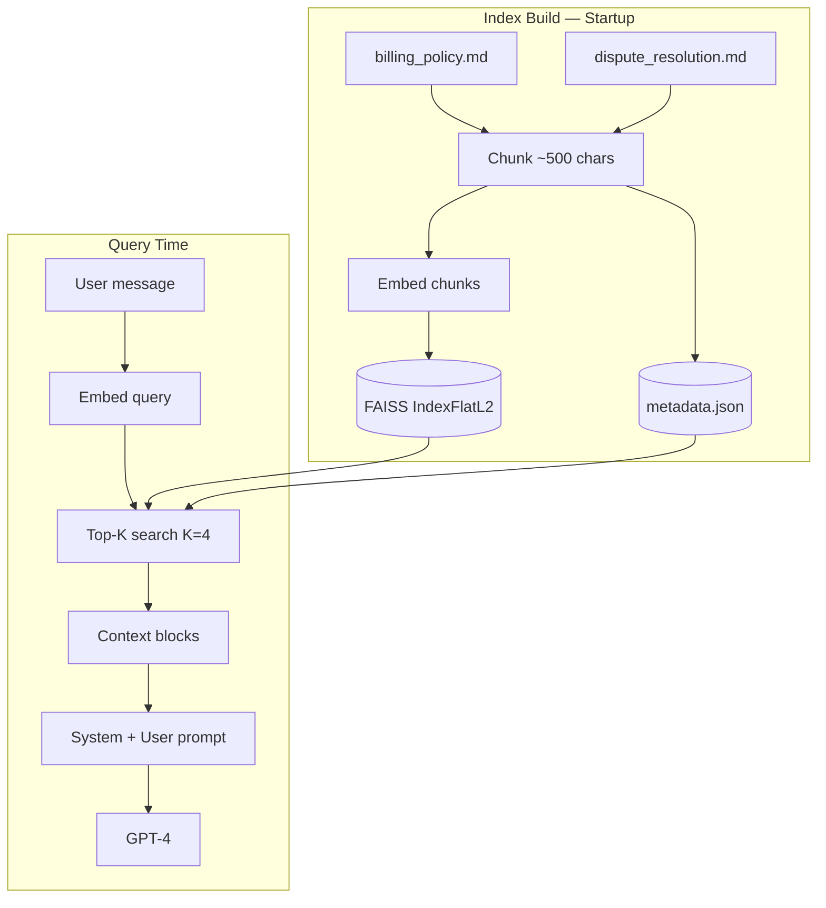
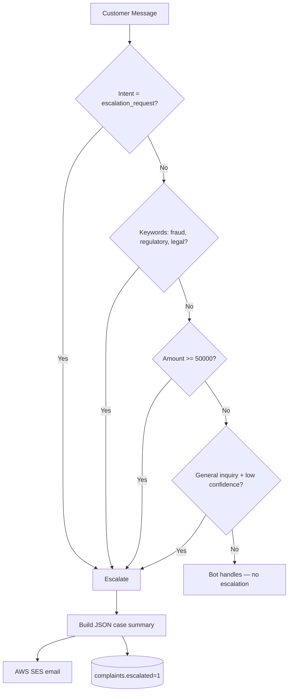
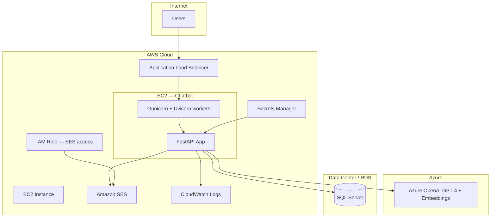

# Finance Customer Complaint Chatbot

> **Resume Project 1** — Production RAG chatbot for finance customer complaints.  
> **Stack:** Azure OpenAI GPT-4 · FAISS · LangChain-style RAG · FastAPI · SQL Server · AWS EC2 · CloudWatch · SES

---

## Table of Contents

1. [Overview](#1-overview)
2. [Business Problem & Goals](#2-business-problem--goals)
3. [System Context](#3-system-context)
4. [High-Level Architecture](#4-high-level-architecture)
5. [Component Architecture](#5-component-architecture)
6. [Sequence Diagram — Chat Request](#6-sequence-diagram--chat-request)
7. [RAG Architecture](#7-rag-architecture)
8. [Escalation Architecture](#8-escalation-architecture)
9. [Deployment Architecture (AWS)](#9-deployment-architecture-aws)
10. [Tech Stack](#10-tech-stack)
11. [Project Structure — File by File](#11-project-structure--file-by-file)
12. [Module Details](#12-module-details)
13. [Prerequisites](#13-prerequisites)
14. [Installation — Step by Step](#14-installation--step-by-step)
15. [Configuration Reference](#15-configuration-reference)
16. [Running Locally](#16-running-locally)
17. [API Reference](#17-api-reference)
18. [Database Schema — Column by Column](#18-database-schema--column-by-column)
19. [Knowledge Base Documents](#19-knowledge-base-documents)
20. [Security & Compliance Notes](#20-security--compliance-notes)
21. [Production Deployment](#21-production-deployment)
22. [Monitoring & Observability](#22-monitoring--observability)
23. [Testing](#23-testing)
24. [Design Decisions & Notes](#24-design-decisions--notes)
25. [Troubleshooting](#25-troubleshooting)

---

## 1. Overview

This project implements an end-to-end **Finance Customer Complaint Chatbot** used by finance operations to triage and resolve customer complaints about:

| Complaint Type | Examples |
|----------------|----------|
| Transaction disputes | Unauthorized charge, wrong amount, chargeback |
| Billing discrepancies | Duplicate invoice, tax error, currency issue |
| Reconciliation status | Statement close date, reconcile pending items |
| Payment delays | Settlement not received, late vendor payment |

**Key capabilities:**

- Conversational AI grounded in internal finance policy documents (RAG)
- Intent classification + entity extraction (account, transaction ID, amount, dates)
- Live SQL lookup of account and recent transactions
- Automatic escalation to human analysts via AWS SES with pre-populated case summary
- Full audit trail of every interaction in SQL Server

---

## 2. Business Problem & Goals

### Problem

Finance ops teams manually handle repetitive complaint emails and portal messages. Analysts spend time:

- Looking up policy documents for SLA timelines
- Querying SQL for account/transaction status
- Deciding whether a case needs escalation
- Writing case summaries for complex complaints

### Goals

| Goal | How This Project Achieves It |
|------|------------------------------|
| Reduce routine handling time | Bot resolves policy/FAQ queries via RAG |
| Consistent compliance language | System prompt + policy-grounded responses |
| Faster escalation | Auto-detect fraud, high-value, low-confidence cases |
| Auditability | Every chat logged in `complaints` table |
| Production readiness | FastAPI on EC2, SES alerts, CloudWatch logs |

### Success Metrics (Production)

- % of queries resolved without escalation
- Average analyst time saved on escalated cases (pre-populated summary)
- Escalation accuracy (false escalation rate)
- Response latency p95 < 3s (excluding LLM cold start)

---

## 3. System Context

Who interacts with the system and external dependencies.



**Notes:**

- Customers interact only via REST API (could be fronted by web portal or Teams bot).
- Azure OpenAI is optional in dev — mock LLM/embeddings work offline.
- SES sends escalation emails to finance ops distribution list.

---

## 4. High-Level Architecture

```mermaid
flowchart LR
    subgraph client [Client Layer]
        WEB[Web / Portal / Postman]
    end

    subgraph api [API Layer]
        FAST[FastAPI + Uvicorn]
        HEALTH[/health]
        CHAT[/chat]
    end

    subgraph nlp [NLP Layer]
        INT[Intent Classifier]
        ENT[Entity Extractor]
        ESC{Escalation Rules}
    end

    subgraph rag [RAG Layer]
        EMB[Embedding Provider]
        FAISS[(FAISS Index)]
        CHAIN[RAG Chain]
        LLM[Azure OpenAI GPT-4]
    end

    subgraph data [Data Layer]
        SQL[(SQL Server)]
        KB[Policy Docs]
    end

    subgraph notify [Notification]
        SES[AWS SES]
    end

    WEB --> FAST
    FAST --> CHAT
    CHAT --> INT
    CHAT --> ENT
    INT --> ESC
    ENT --> SQL
    CHAT --> CHAIN
    CHAIN --> EMB
    EMB --> FAISS
    FAISS --> KB
    CHAIN --> LLM
    SQL --> CHAIN
    ESC -->|Yes| SES
    CHAT --> SQL
```

---

## 5. Component Architecture

Internal Python modules and their relationships.



| Component | File | Responsibility |
|-----------|------|----------------|
| Entry point | `main.py` | FastAPI app, startup, routes |
| Orchestrator | `chatbot_service.py` | Coordinates full chat flow |
| Intent/NLP | `intent_classifier.py` | Intent, entities, escalation, mock/Azure LLM |
| RAG chain | `chain.py` | Retrieve context + generate reply |
| Vector store | `vectorstore.py` | FAISS index build/search |
| Embeddings | `embeddings.py` | Azure or hash-based mock embeddings |
| Account lookup | `account_lookup.py` | SQL account + transaction snapshot |
| Escalation | `escalation_service.py` | AWS SES email |
| Database | `database.py` | SQLAlchemy models + seed data |
| Config | `config.py` | pydantic-settings from `.env` |
| Schemas | `schemas.py` | Pydantic request/response models |

---

## 6. Sequence Diagram — Chat Request

Step-by-step flow for a single `/chat` request.



### Step-by-step (numbered)

1. **Receive** — FastAPI validates `ChatRequest` (message 1–4000 chars).
2. **Classify intent** — Keyword rules + priority for "dispute" → 7 intent types.
3. **Extract entities** — Regex for `ACC-*`, `TXN-*`, amounts, dates.
4. **Check escalation** — Fraud keywords, amount ≥ $50K, supervisor request, low confidence.
5. **Account lookup** — If account ID found, query `accounts` + last 5 `transactions`.
6. **RAG retrieval** — Embed query, FAISS top-4 chunks from policy docs.
7. **LLM generation** — System prompt with compliance rules + context + account data.
8. **Escalation email** — If flagged, JSON case summary to SES recipients.
9. **Audit log** — Insert row into `complaints` with full payload.
10. **Respond** — Return `ChatResponse` with reply, intent, entities, sources.

---

## 7. RAG Architecture



### RAG details

| Setting | Value | Notes |
|---------|-------|-------|
| Chunk size | ~500 chars | Word-based sliding window |
| Top-K | 4 | Retrieved policy chunks |
| Index type | FAISS IndexFlatL2 | Exact L2 search |
| Embedding dim | 384 (mock) / 1536 (Azure ada-002) | Depends on provider |
| LLM temperature | 0.2 | Low creativity for policy answers |
| Max tokens | 800 | Response length cap |

### System prompt rules

- Use ONLY retrieved context and account data
- Include disclaimer: *"This response is informational and does not constitute legal advice."*
- Do not promise refunds
- Do not share other customers' data
- Ask for account number + transaction ID if missing

---

## 8. Escalation Architecture



**Case summary JSON includes:**

- Original customer message
- Detected intent + confidence
- Extracted entities
- Account snapshot (if found)
- RAG source document names

---

## 9. Deployment Architecture (AWS)



### Deployment checklist

- [ ] EC2 Amazon Linux 2 / Ubuntu with Python 3.11
- [ ] Security group: 443 from ALB only
- [ ] IAM role for SES (no access keys in `.env`)
- [ ] Azure OpenAI endpoint reachable from EC2
- [ ] SQL Server connection string in Secrets Manager
- [ ] CloudWatch agent configured
- [ ] Health check on `/health`
- [ ] Gunicorn with 2+ Uvicorn workers

---

## 10. Tech Stack

| Layer | Technology | Version / Notes |
|-------|------------|-----------------|
| Language | Python | 3.10+ |
| API framework | FastAPI | OpenAPI auto-docs at `/docs` |
| ASGI server | Uvicorn / Gunicorn | Dev / prod |
| LLM | Azure OpenAI GPT-4 | Or mock client offline |
| Embeddings | text-embedding-ada-002 | Or hash mock |
| Vector DB | FAISS (local index) | CPU, faiss-cpu |
| ORM | SQLAlchemy 2.x | SQLite + MSSQL |
| Validation | Pydantic v2 | Request/response schemas |
| Config | pydantic-settings | `.env` file |
| AWS SDK | boto3 | SES |
| Testing | pytest + TestClient | 3 API tests |

---

## 11. Project Structure — File by File

```
finance-complaint-chatbot/
├── README.md                    ← This file
├── requirements.txt             ← Python dependencies
├── .env.example                 ← Environment template
│
├── data/
│   ├── knowledge_base/
│   │   ├── billing_policy.md    ← RAG: billing rules, SLAs
│   │   └── dispute_resolution.md← RAG: escalation runbook
│   ├── faiss_index/             ← Auto-generated at startup
│   │   ├── index.faiss
│   │   └── metadata.json
│   └── finance.db               ← SQLite dev database
│
├── scripts/
│   ├── init_db.sql              ← SQL Server DDL
│   └── seed_db.py               ← Insert sample accounts/transactions
│
├── src/
│   ├── main.py
│   ├── config.py
│   ├── database.py
│   ├── models/schemas.py
│   ├── nlp/intent_classifier.py
│   ├── rag/embeddings.py
│   ├── rag/vectorstore.py
│   ├── rag/chain.py
│   └── services/
│       ├── chatbot_service.py
│       ├── account_lookup.py
│       └── escalation_service.py
│
└── tests/test_api.py
```

---

## 12. Module Details

### `src/main.py`

- Creates FastAPI app with title, description, version
- **Startup:** `init_db()`, `seed_sample_data()`, load FAISS index
- **Routes:** `GET /health`, `POST /chat`
- **Error handling:** 500 with exception detail on failure

### `src/config.py`

- `Settings` class loads from `.env`
- Properties: `use_azure_openai`, `escalation_emails`, `project_root`
- Cached via `@lru_cache` singleton

### `src/database.py`

- Models: `Account`, `Transaction`, `Complaint`
- `get_session()` context manager with commit/rollback
- `seed_sample_data()` — 2 accounts, 3 transactions (dev)

### `src/nlp/intent_classifier.py`

- `classify_intent()` — keyword scoring across 6 intent categories
- `extract_entities()` — regex extraction
- `should_escalate()` — business rules
- `MockLLMClient` / `AzureOpenAIClient` — pluggable LLM
- `build_case_summary()` — JSON for escalation email

### `src/rag/vectorstore.py`

- `FAISSVectorStore.build_from_knowledge_base()` — index from markdown
- `search(query, k)` — returns chunks with source + score
- Persists to `data/faiss_index/`

### `src/rag/chain.py`

- `RAGChain.answer()` — retrieve + prompt + LLM call
- Returns `(reply_text, source_file_names)`

### `src/services/chatbot_service.py`

- **Main orchestrator** — wires all components in `handle()`

---

## 13. Prerequisites

| Requirement | Dev | Production |
|-------------|-----|--------------|
| Python 3.10+ | Required | Required |
| pip / venv | Required | Required |
| Azure OpenAI | Optional (mock) | Required |
| SQL Server | Optional (SQLite) | Required |
| AWS SES | Optional (logs only) | Required |
| ODBC Driver 17 | For MSSQL only | Required |

---

## 14. Installation — Step by Step

```powershell
# 1. Navigate to project
cd finance-complaint-chatbot

# 2. Create virtual environment
python -m venv .venv
.\.venv\Scripts\Activate.ps1

# 3. Install dependencies
pip install -r requirements.txt

# 4. Configure environment
copy .env.example .env
# Edit .env for Azure/AWS/SQL Server if needed

# 5. Seed database
python scripts/seed_db.py

# 6. Run API
$env:PYTHONPATH="."
uvicorn src.main:app --reload --port 8000
```

---

## 15. Configuration Reference

| Variable | Required | Default | Description |
|----------|----------|---------|-------------|
| `AZURE_OPENAI_API_KEY` | Prod | — | Azure API key |
| `AZURE_OPENAI_ENDPOINT` | Prod | — | `https://{resource}.openai.azure.com/` |
| `AZURE_OPENAI_DEPLOYMENT` | No | `gpt-4` | Chat deployment name |
| `AZURE_OPENAI_EMBEDDING_DEPLOYMENT` | No | `text-embedding-ada-002` | Embedding deployment |
| `AZURE_OPENAI_API_VERSION` | No | `2024-02-15-preview` | API version |
| `DB_ENGINE` | No | `sqlite` | `sqlite` or `mssql` |
| `SQLITE_PATH` | No | `./data/finance.db` | SQLite file path |
| `MSSQL_CONNECTION_STRING` | MSSQL | — | ODBC connection string |
| `AWS_REGION` | No | `ap-south-1` | SES region |
| `AWS_ACCESS_KEY_ID` | No | — | Leave empty to use IAM role |
| `AWS_SECRET_ACCESS_KEY` | No | — | Leave empty to use IAM role |
| `SES_SENDER` | Prod | — | Verified SES sender |
| `SES_ESCALATION_RECIPIENTS` | Prod | — | Comma-separated emails |
| `APP_HOST` | No | `0.0.0.0` | Bind host |
| `APP_PORT` | No | `8000` | Bind port |
| `FAISS_INDEX_PATH` | No | `./data/faiss_index` | Index directory |
| `LOG_LEVEL` | No | `INFO` | Logging level |

---

## 16. Running Locally

| URL | Purpose |
|-----|---------|
| http://localhost:8000/docs | Swagger UI |
| http://localhost:8000/health | Health check |
| http://localhost:8000/chat | POST chat endpoint |

### curl example

```bash
curl -X POST http://localhost:8000/chat \
  -H "Content-Type: application/json" \
  -d "{\"message\": \"Dispute TXN-900001 on ACC-10001 duplicate charge\"}"
```

---

## 17. API Reference

### GET `/health`

**Response:**
```json
{
  "status": "ok",
  "azure_openai": false,
  "database": "sqlite",
  "faiss_index": true
}
```

### POST `/chat`

**Request body:**

| Field | Type | Required | Constraints |
|-------|------|----------|-------------|
| `message` | string | Yes | 1–4000 characters |
| `session_id` | string | No | Optional tracking ID |

**Response fields:**

| Field | Type | Description |
|-------|------|-------------|
| `reply` | string | Bot response text |
| `intent` | string | Classified intent |
| `confidence` | float | 0.0–1.0 |
| `entities` | object | account_number, transaction_id, date_range, amount |
| `escalated` | bool | Whether case was escalated |
| `case_summary` | string | JSON summary if escalated |
| `complaint_id` | int | Audit log ID |
| `sources` | list | RAG source filenames |

---

## 18. Database Schema — Column by Column

### `accounts`

| Column | Type | Description |
|--------|------|-------------|
| `account_id` | VARCHAR(20) PK | e.g. ACC-10001 |
| `customer_name` | NVARCHAR(100) | Customer display name |
| `status` | VARCHAR(20) | ACTIVE, SUSPENDED, etc. |
| `created_at` | DATETIME2 | Record creation |

### `transactions`

| Column | Type | Description |
|--------|------|-------------|
| `transaction_id` | VARCHAR(30) PK | e.g. TXN-900001 |
| `account_id` | VARCHAR(20) FK | Links to accounts |
| `amount` | DECIMAL(18,2) | Positive or negative |
| `currency` | CHAR(3) | Default USD |
| `posting_date` | DATE | Ledger posting date |
| `description` | NVARCHAR(255) | Transaction memo |
| `status` | VARCHAR(20) | POSTED, PENDING, etc. |

### `complaints`

| Column | Type | Description |
|--------|------|-------------|
| `complaint_id` | INT PK | Auto-increment |
| `account_id` | VARCHAR(20) | Extracted account |
| `transaction_id` | VARCHAR(30) | Extracted transaction |
| `intent` | VARCHAR(50) | Classified intent |
| `message` | NVARCHAR(MAX) | Original user message |
| `bot_response` | NVARCHAR(MAX) | Generated reply |
| `escalated` | BIT | 0 or 1 |
| `case_summary` | NVARCHAR(MAX) | JSON if escalated |
| `created_at` | DATETIME2 | Timestamp |

---

## 19. Knowledge Base Documents

| File | Content |
|------|---------|
| `billing_policy.md` | Dispute windows, billing SLAs, payment delays, escalation criteria |
| `dispute_resolution.md` | Runbook steps, compliance language, response boundaries |

**To update policies:** Edit markdown → delete `data/faiss_index/` → restart app to rebuild index.

---

## 20. Security & Compliance Notes

- **PII:** Account IDs and transaction data stay in SQL — not sent to LLM beyond account snapshot in prompt
- **Prompt injection:** System prompt instructs model to stay within policy context
- **Audit:** All interactions logged in `complaints` table
- **SES:** Use verified domains; IAM roles preferred over access keys
- **Secrets:** Use AWS Secrets Manager in production, never commit `.env`
- **Disclaimer:** Every response should include non-legal-advice disclaimer (enforced in system prompt)

---

## 21. Production Deployment

```bash
pip install -r requirements.txt gunicorn
gunicorn src.main:app \
  -k uvicorn.workers.UvicornWorker \
  -b 0.0.0.0:8000 \
  --workers 2 \
  --timeout 120
```

Set environment via EC2 user-data or Systems Manager Parameter Store.

---

## 22. Monitoring & Observability

| Signal | Tool | Notes |
|--------|------|-------|
| App logs | CloudWatch | Request errors, escalation events |
| Health | ALB → `/health` | FAISS + DB status |
| LLM latency | Custom metric | Log time in RAG chain |
| Escalation rate | SQL query on `complaints` | Daily dashboard |
| SES bounces | SES console | Verify recipient emails |

---

## 23. Testing

```powershell
$env:PYTHONPATH="."
pytest tests/ -v
```

| Test | Validates |
|------|-----------|
| `test_health` | API is up |
| `test_chat_dispute` | Intent + entity extraction |
| `test_chat_escalation` | Fraud/supervisor triggers escalation |

---

## 24. Design Decisions & Notes

1. **Mock mode first** — Enables demo without Azure/AWS credentials.
2. **FAISS local index** — Simple, no Pinecone dependency; rebuild on KB change.
3. **Rule-based intent** — Fast, explainable; can swap for ML classifier later.
4. **Regex entities** — Finance IDs follow predictable patterns (ACC-, TXN-).
5. **Escalation before response** — Analyst gets email even if bot also replies.
6. **SQLite dev / MSSQL prod** — Same SQLAlchemy models, switch via `DB_ENGINE`.

---

## 25. Troubleshooting

| Symptom | Cause | Fix |
|---------|-------|-----|
| `ModuleNotFoundError: src` | PYTHONPATH not set | `$env:PYTHONPATH="."` |
| Empty/generic RAG reply | Index not built | Restart app; check `data/knowledge_base/` |
| `azure_openai: false` | No credentials | Set `.env` Azure vars |
| SES not received | Dev mock mode | Check console logs for email body |
| Account not found | DB not seeded | `python scripts/seed_db.py` |
| Wrong intent | Keyword overlap | "dispute" takes priority over "billing" |
| Slow first request | FAISS index build | Expected on cold start |
