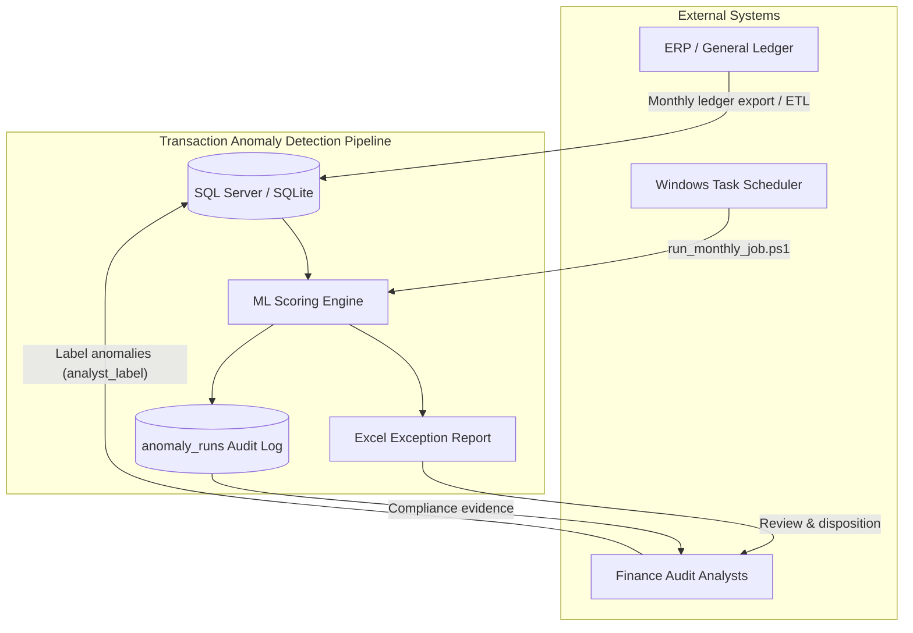
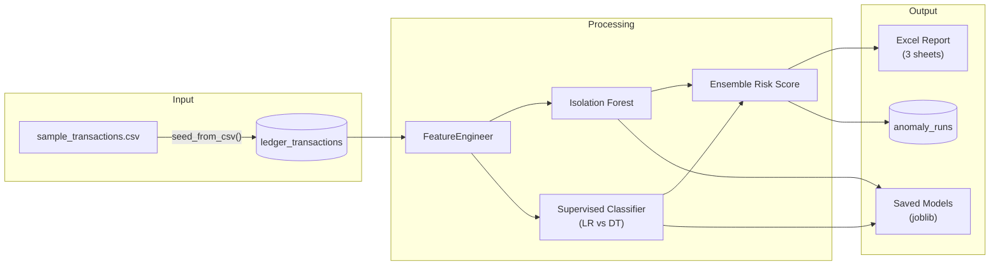
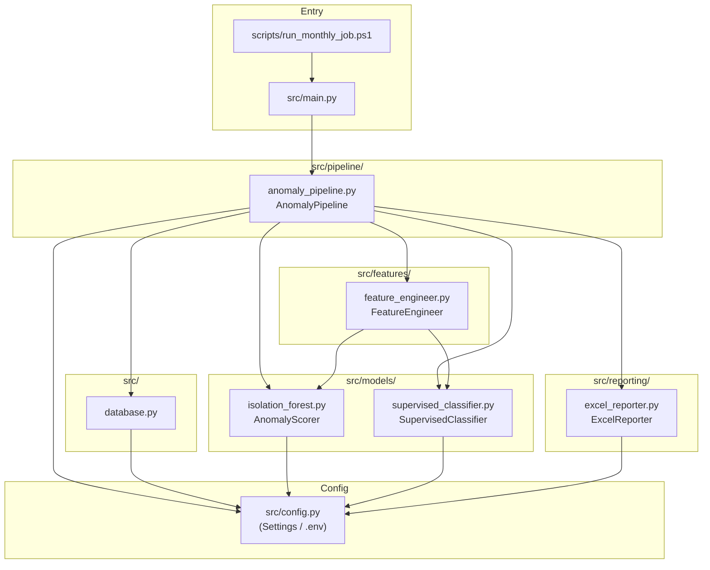
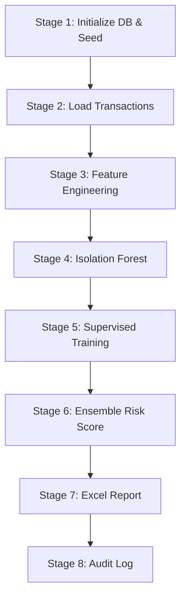
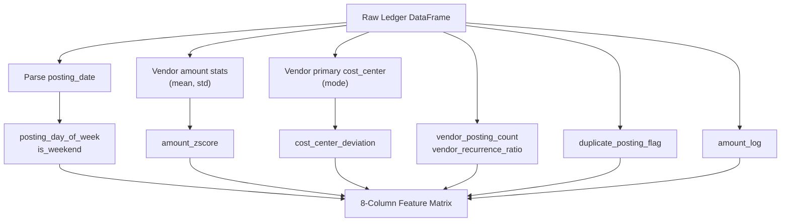
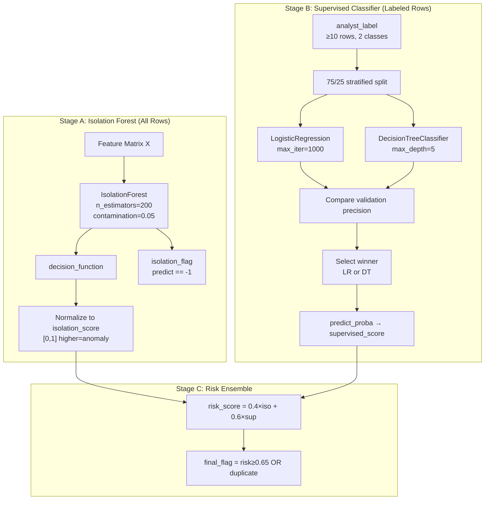
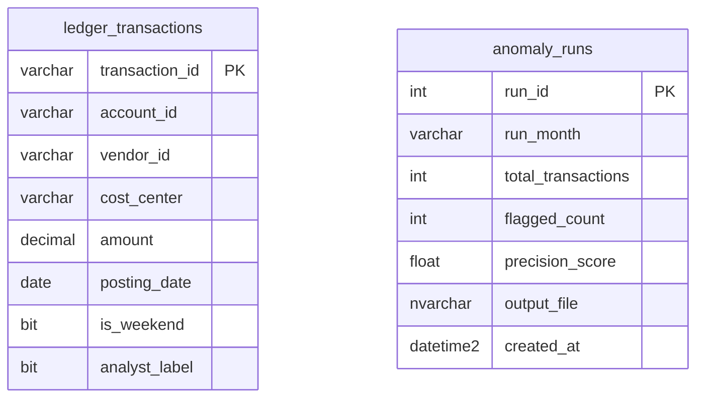
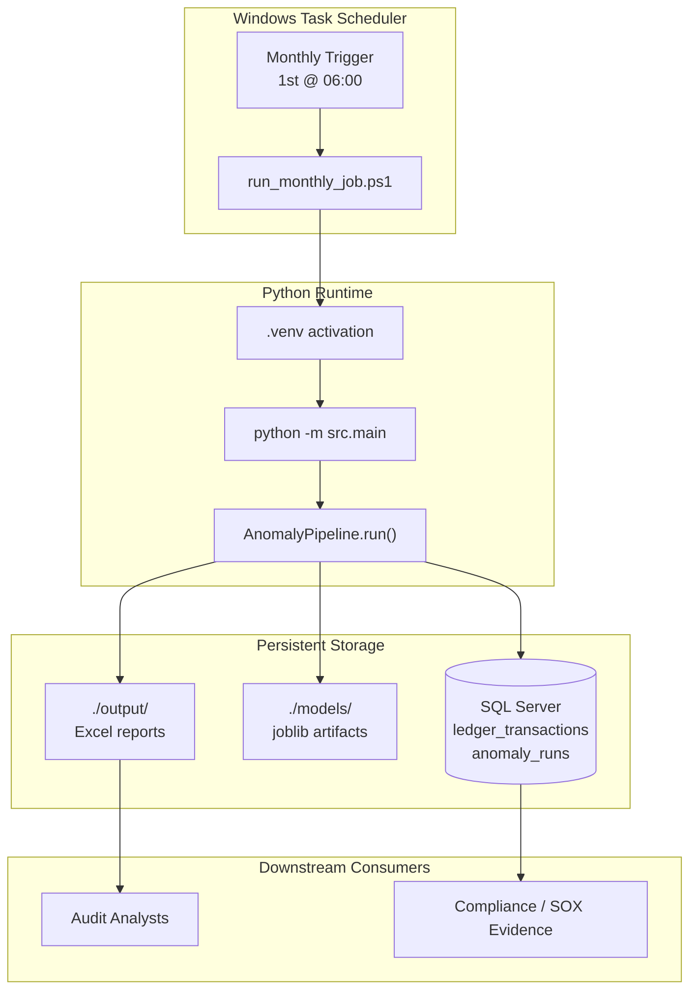
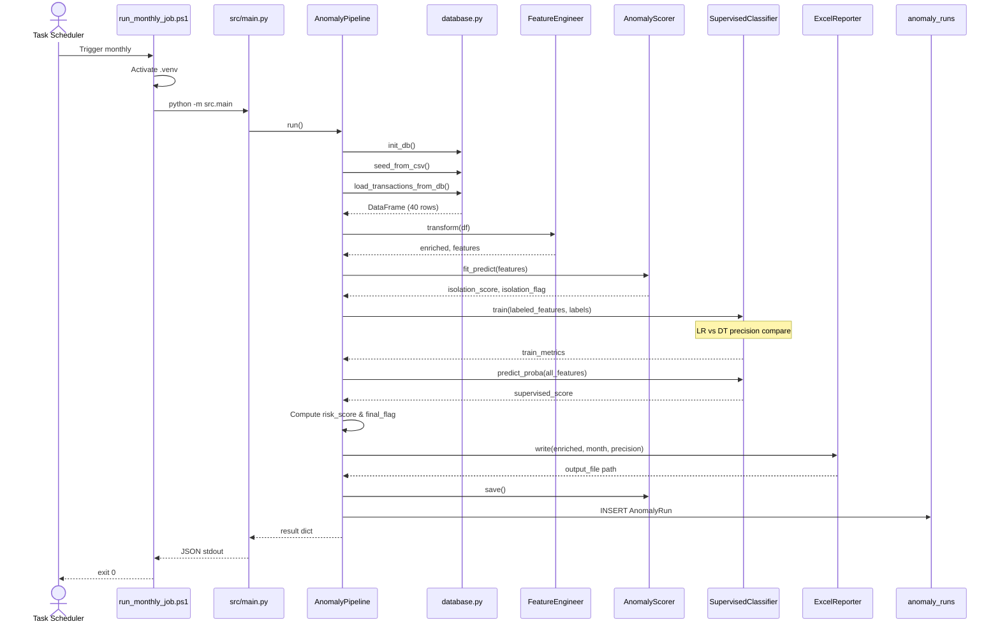

# Finance Transaction Anomaly Detection

> **Resume Project 3** — Production-style ML pipeline to detect anomalous finance ledger transactions using Isolation Forest, Logistic Regression, Decision Tree ensemble scoring, SQL persistence, and Excel exception reporting for audit and risk teams.

---

## Table of Contents

1. [Overview](#1-overview)
2. [Business Problem](#2-business-problem)
3. [Precision Target & Success Criteria](#3-precision-target--success-criteria)
4. [System Context](#4-system-context)
5. [High-Level Architecture](#5-high-level-architecture)
6. [Component Architecture](#6-component-architecture)
7. [Tech Stack](#7-tech-stack)
8. [Project Structure (File-by-File)](#8-project-structure-file-by-file)
9. [Installation](#9-installation)
10. [Environment Configuration](#10-environment-configuration)
11. [Running the Pipeline](#11-running-the-pipeline)
12. [Pipeline Stages (Step-by-Step)](#12-pipeline-stages-step-by-step)
13. [Feature Engineering](#13-feature-engineering)
14. [ML Model Flow](#14-ml-model-flow)
15. [Module Reference: `anomaly_pipeline.py`](#15-module-reference-anomaly_pipelinepy)
16. [Module Reference: `feature_engineer.py`](#16-module-reference-feature_engineerpy)
17. [Module Reference: `isolation_forest.py`](#17-module-reference-isolation_forestpy)
18. [Module Reference: `supervised_classifier.py`](#18-module-reference-supervised_classifierpy)
19. [Module Reference: `excel_reporter.py`](#19-module-reference-excel_reporterpy)
20. [Module Reference: `database.py`](#20-module-reference-databasepy)
21. [Excel Report Sheets](#21-excel-report-sheets)
22. [Database Schema](#22-database-schema)
23. [Sample Console JSON Output](#23-sample-console-json-output)
24. [Monthly Job Scheduling](#24-monthly-job-scheduling)
25. [Deployment & Scheduling Architecture](#25-deployment--scheduling-architecture)
26. [Pipeline Run Sequence Diagram](#26-pipeline-run-sequence-diagram)
27. [Testing](#27-testing)
28. [Troubleshooting](#28-troubleshooting)
29. [Design Decisions](#29-design-decisions)
30. [Sample Data & Labeling Guide](#30-sample-data--labeling-guide)

---

## 1. Overview

This project implements an end-to-end **Finance Transaction Anomaly Detection** pipeline. It ingests ledger transactions from a relational database, engineers eight behavioral and statistical features, scores every transaction with an unsupervised Isolation Forest model, refines predictions with a supervised classifier trained on analyst labels, and produces a ranked Excel exception report plus an audit log row for each monthly run.

Key capabilities:

| Capability | Description |
|------------|-------------|
| Unsupervised detection | Isolation Forest flags global outliers without labels |
| Supervised refinement | Logistic Regression vs Decision Tree selected by validation precision |
| Ensemble scoring | Weighted risk score: 40% isolation + 60% supervised |
| Hard rules | Duplicate postings always flagged regardless of ML score |
| Audit trail | Every run persisted to `anomaly_runs` with precision metrics |
| Analyst deliverable | Three-sheet Excel workbook ranked by `risk_score` |

The pipeline is designed for **monthly close** workflows: finance analysts receive a prioritized exception list instead of manually sampling thousands of ledger rows.

---

## 2. Business Problem

Finance audit and risk teams face recurring challenges during monthly close:

| Challenge | Impact |
|-----------|--------|
| Volume | Thousands of ledger postings per month; manual review is infeasible |
| Duplicate postings | Same invoice posted twice inflates expenses and distorts reporting |
| Outlier amounts | One-off spikes (e.g., $500K vs typical $12K) indicate fraud or data entry errors |
| Cost center misallocation | Vendor charged to wrong department breaks budget controls |
| Timing anomalies | Weekend or off-pattern postings may indicate unauthorized activity |
| False positives | Pure rule-based systems overwhelm analysts with noise |

### Anomaly Types Detected

| Anomaly Type | Primary Signal | Feature(s) |
|--------------|----------------|------------|
| Duplicate posting | Identical account/vendor/amount/date | `duplicate_posting_flag` (hard flag) |
| Outlier amount | Amount far from vendor historical mean | `amount_zscore`, `amount_log` |
| Wrong cost center | CC differs from vendor's modal CC | `cost_center_deviation` |
| Unusual timing | Weekend or atypical day-of-week posting | `is_weekend`, `posting_day_of_week` |
| Rare vendor activity | Vendor appears infrequently in ledger | `vendor_recurrence_ratio`, `vendor_posting_count` |
| Composite risk | Multiple weak signals combined | `risk_score` ensemble |

### Manual vs Automated Comparison

| Step | Manual Process | This Pipeline |
|------|----------------|---------------|
| Load ledger | Export from ERP to spreadsheet | SQL query via SQLAlchemy |
| Identify duplicates | Pivot tables, VLOOKUP | `duplicate_posting_flag` feature |
| Find amount outliers | Sort by amount, eyeball | Vendor-level z-score + Isolation Forest |
| Validate cost centers | Cross-reference vendor master | `cost_center_deviation` vs vendor mode |
| Prioritize review queue | Subjective ranking | `risk_score` descending in Excel |
| Audit evidence | Ad-hoc files | `anomaly_runs` table + timestamped Excel |

---

## 3. Precision Target & Success Criteria

The pipeline targets **88% validation precision** on analyst-labeled transactions, configured via `VALIDATION_PRECISION_TARGET=0.88` in `.env`.

### Why Precision Matters

In audit workflows, **precision** (of flagged items, how many are true anomalies) is prioritized over recall. Analysts have limited bandwidth; sending them 200 false positives when only 20 are real wastes time and erodes trust in the system.

### How Precision Is Measured

When at least 10 labeled rows exist (`analyst_label` not null), the supervised classifier:

1. Splits labeled data 75/25 (stratified) via `train_test_split`
2. Trains both Logistic Regression and Decision Tree
3. Computes `precision_score` on the held-out test set for each model
4. Selects the model with higher precision
5. Returns `validation_precision` in the pipeline result and writes it to the Excel Summary sheet

The 88% target is a **design goal** documented in configuration. The sample dataset with 40 transactions (10 labeled) achieves 100% validation precision with Logistic Regression selected over Decision Tree (1.0 vs 0.5 precision on the test fold).

### Operational Success Criteria

| Metric | Target | Source |
|--------|--------|--------|
| Validation precision | ≥ 88% | `VALIDATION_PRECISION_TARGET` |
| Coverage | 100% of ledger rows scored | Pipeline processes all DB rows |
| Duplicate detection | 100% of duplicates flagged | Hard rule on `duplicate_posting_flag` |
| Run auditability | Every run logged | `anomaly_runs` insert |
| Deliverable | Ranked Excel within minutes | `ExcelReporter.write()` |

---

## 4. System Context

Shows how the anomaly detection pipeline sits within the broader finance operations ecosystem.



**Actors:**

- **ERP / General Ledger** — Source of truth for `ledger_transactions`
- **Finance Analysts** — Provide ground-truth labels; review flagged exceptions
- **Windows Task Scheduler** — Triggers monthly automated runs
- **Pipeline** — Scores, reports, and logs every run

---

## 5. High-Level Architecture



Data flows left-to-right: load → engineer features → dual ML scoring → ensemble → report and audit.

---

## 6. Component Architecture



---

## 7. Tech Stack

| Layer | Technology | Purpose |
|-------|------------|---------|
| Language | Python 3.10+ | Pipeline runtime |
| Data manipulation | pandas, numpy | Feature engineering, DataFrames |
| ML — unsupervised | scikit-learn `IsolationForest` | Global outlier detection |
| ML — supervised | scikit-learn `LogisticRegression`, `DecisionTreeClassifier` | Label-driven refinement |
| Model persistence | joblib | Serialize trained models to `./models/` |
| Database ORM | SQLAlchemy 2.x | Schema, sessions, bulk load |
| Database engines | SQLite (dev), SQL Server via pyodbc (prod) | Ledger and audit storage |
| Configuration | pydantic-settings | Type-safe `.env` loading |
| Reporting | openpyxl | Styled Excel workbooks |
| Testing | pytest | End-to-end pipeline tests |
| Scheduling | PowerShell + Windows Task Scheduler | Monthly automated execution |

---

## 8. Project Structure (File-by-File)

```
transaction-anomaly-detection/
├── README.md                          # This documentation
├── requirements.txt                   # Python dependencies with minimum versions
├── .env.example                       # Environment variable template
├── .env                               # Local secrets (not committed; copy from example)
│
├── data/
│   └── sample_transactions.csv        # 40-row sample ledger with analyst labels
│
├── models/                            # Created at runtime; persisted ML artifacts
│   ├── isolation_forest.joblib        # Fitted Isolation Forest
│   ├── logistic_regression.joblib     # Fitted Logistic Regression
│   ├── decision_tree.joblib           # Fitted Decision Tree
│   └── active_model.txt               # Which supervised model was selected
│
├── output/                            # Created at runtime; Excel reports
│   └── anomaly_report_YYYY-MM_*.xlsx  # Timestamped exception workbooks
│
├── scripts/
│   ├── init_db.sql                    # SQL Server DDL for production deployment
│   ├── seed_db.py                     # Standalone CSV → database seed utility
│   └── run_monthly_job.ps1            # PowerShell wrapper for Task Scheduler
│
├── src/
│   ├── main.py                        # CLI entry point; delegates to pipeline main()
│   ├── config.py                      # Settings class loaded from .env
│   ├── database.py                    # ORM models, engine, seed/load helpers
│   ├── features/
│   │   └── feature_engineer.py        # 8-feature transformation pipeline
│   ├── models/
│   │   ├── isolation_forest.py        # AnomalyScorer (Isolation Forest wrapper)
│   │   └── supervised_classifier.py   # LR + DT training and model selection
│   ├── pipeline/
│   │   └── anomaly_pipeline.py        # Orchestrator: run() coordinates all stages
│   └── reporting/
│       └── excel_reporter.py          # Three-sheet Excel workbook generator
│
└── tests/
    └── test_pipeline.py               # Integration tests for full pipeline run
```

### File Reference

| File | Role |
|------|------|
| `README.md` | Project documentation |
| `requirements.txt` | Pins pandas, scikit-learn, sqlalchemy, openpyxl, pytest, etc. |
| `.env.example` | Documents all configurable environment variables |
| `data/sample_transactions.csv` | Demo ledger: 40 transactions, 10 with `analyst_label` |
| `scripts/init_db.sql` | Production SQL Server schema with indexes |
| `scripts/seed_db.py` | One-command database seed from CSV |
| `scripts/run_monthly_job.ps1` | Activates venv, runs `python -m src.main` |
| `src/main.py` | Thin entry point importing `AnomalyPipeline.main` |
| `src/config.py` | `Settings` dataclass with defaults and `get_settings()` cache |
| `src/database.py` | `LedgerTransaction`, `AnomalyRun` models and data access |
| `src/features/feature_engineer.py` | `FeatureEngineer.transform()` |
| `src/models/isolation_forest.py` | `AnomalyScorer.fit_predict()` and persistence |
| `src/models/supervised_classifier.py` | `SupervisedClassifier.train()` with LR/DT selection |
| `src/pipeline/anomaly_pipeline.py` | `AnomalyPipeline.run()` orchestration |
| `src/reporting/excel_reporter.py` | `ExcelReporter.write()` |
| `tests/test_pipeline.py` | Validates pipeline execution and precision floor |

---

## 9. Installation

### Prerequisites

- Python 3.10 or later
- PowerShell (Windows) for scheduling scripts
- Optional: SQL Server + ODBC Driver 17/18 for production (`DB_ENGINE=mssql`)

### Step-by-Step Setup

**Step 1 — Clone or navigate to the project**

```powershell
cd c:\Users\Admin\Desktop\Work\transaction-anomaly-detection
```

**Step 2 — Create and activate a virtual environment**

```powershell
python -m venv .venv
.\.venv\Scripts\Activate.ps1
```

**Step 3 — Install dependencies**

```powershell
pip install -r requirements.txt
```

**Step 4 — Configure environment**

```powershell
copy .env.example .env
# Edit .env as needed (defaults work for local SQLite development)
```

**Step 5 — Seed the database (optional; pipeline also seeds on each run)**

```powershell
python scripts/seed_db.py
```

**Step 6 — Run the pipeline**

```powershell
python -m src.main
```

**Step 7 — Verify output**

- Console: JSON summary printed to stdout
- File system: `output/anomaly_report_*.xlsx`
- Models: `models/isolation_forest.joblib` and supervised model files
- Database: `data/finance_ledger.db` (SQLite) with `anomaly_runs` row

### SQL Server Setup (Production)

1. Execute `scripts/init_db.sql` against your SQL Server instance
2. Load production ledger data into `ledger_transactions`
3. Set in `.env`:

```env
DB_ENGINE=mssql
MSSQL_CONNECTION_STRING=Driver={ODBC Driver 17 for SQL Server};Server=...;Database=...;Trusted_Connection=yes;
```

---

## 10. Environment Configuration

All settings are defined in `src/config.py` and loaded from `.env` via pydantic-settings. Environment variable names are uppercase versions of the Python field names.

### Full `.env` Reference

| Variable | Type | Default | Description |
|----------|------|---------|-------------|
| `DB_ENGINE` | string | `sqlite` | Database backend: `sqlite` or `mssql` |
| `SQLITE_PATH` | string | `./data/finance_ledger.db` | Path to SQLite database file (relative to project root) |
| `MSSQL_CONNECTION_STRING` | string | `""` | ODBC connection string for SQL Server (required when `DB_ENGINE=mssql`) |
| `MODEL_PATH` | string | `./models` | Directory for joblib model artifacts |
| `OUTPUT_PATH` | string | `./output` | Directory for Excel reports |
| `SAMPLE_CSV_PATH` | string | `./data/sample_transactions.csv` | CSV used by `seed_from_csv()` — note: not in `.env.example` but configurable in code |
| `RANDOM_STATE` | int | `42` | Seed for Isolation Forest, train/test split, and classifiers |
| `ISOLATION_FOREST_CONTAMINATION` | float | `0.05` | Expected proportion of outliers (5%) for Isolation Forest |
| `ANOMALY_SCORE_THRESHOLD` | float | `0.65` | Minimum `risk_score` (or supervised score) to flag a transaction |
| `VALIDATION_PRECISION_TARGET` | float | `0.88` | Documented precision goal (88%) for supervised model quality |
| `RUN_MONTH` | string | `auto` | Report month label; `auto` resolves to current `YYYY-MM` |
| `LOG_LEVEL` | string | `INFO` | Python logging level for pipeline execution |

### Example `.env` File

```env
# Database
DB_ENGINE=sqlite
SQLITE_PATH=./data/finance_ledger.db
MSSQL_CONNECTION_STRING=

# ML Pipeline
MODEL_PATH=./models
OUTPUT_PATH=./output
RANDOM_STATE=42
ISOLATION_FOREST_CONTAMINATION=0.05
ANOMALY_SCORE_THRESHOLD=0.65
VALIDATION_PRECISION_TARGET=0.88

# Scheduling
RUN_MONTH=auto
LOG_LEVEL=INFO
```

### Configuration Loading

```python
from functools import lru_cache
from pydantic_settings import BaseSettings

@lru_cache
def get_settings() -> Settings:
    return Settings()  # Reads .env automatically
```

Settings are cached for the process lifetime via `@lru_cache` on `get_settings()`.

---

## 11. Running the Pipeline

### Standard Execution

```powershell
python -m src.main
```

Equivalent to:

```powershell
python -c "from src.pipeline.anomaly_pipeline import main; main()"
```

### What Happens on Each Run

1. `init_db()` — Creates tables if they do not exist
2. `seed_from_csv()` — Replaces `ledger_transactions` with CSV contents (dev workflow)
3. Full ML pipeline executes
4. JSON result printed to stdout
5. Excel report written to `output/`
6. `AnomalyRun` row inserted into database

### Override Run Month

Pass `run_month` programmatically:

```python
from src.pipeline.anomaly_pipeline import AnomalyPipeline

pipeline = AnomalyPipeline()
result = pipeline.run(run_month="2025-02")
```

Or set `RUN_MONTH=2025-02` in `.env`.

---

## 12. Pipeline Stages (Step-by-Step)

The `AnomalyPipeline.run()` method in `src/pipeline/anomaly_pipeline.py` executes these stages sequentially:



### Stage 1: Initialize Database & Seed

```python
init_db()
seed_from_csv()
```

- Creates `ledger_transactions` and `anomaly_runs` tables via SQLAlchemy metadata
- Loads `data/sample_transactions.csv` into `ledger_transactions` (replace mode)
- In production, skip seeding and load from ERP ETL instead

### Stage 2: Load Data

```python
df = load_transactions_from_db()
```

Executes `SELECT * FROM ledger_transactions` and returns a pandas DataFrame with columns:

`transaction_id`, `account_id`, `vendor_id`, `cost_center`, `amount`, `posting_date`, `is_weekend`, `analyst_label`

### Stage 3: Feature Engineering

```python
enriched, features = self.feature_engineer.transform(df)
```

Returns:

- `enriched` — Original columns plus engineered fields and intermediate stats
- `features` — 8-column numeric matrix used by ML models

### Stage 4: Isolation Forest

```python
iso_scores, iso_flags = self.isolation_forest.fit_predict(features.values)
enriched["isolation_score"] = iso_scores
enriched["isolation_flag"] = iso_flags
```

- Fits Isolation Forest on all rows (unsupervised)
- Normalizes `decision_function` output to [0, 1] where higher = more anomalous
- Sets binary flag where model predicts outlier (`predict == -1`)

### Stage 5: Supervised Training (LR vs DT Selection)

```python
labeled = enriched[enriched["analyst_label"].notna()].copy()
if len(labeled) >= 10:
    train_metrics = self.classifier.train(labeled_features, labeled["analyst_label"].astype(int).values)
```

Requirements:

- Minimum **10 labeled rows**
- At least **2 distinct label values** (0 and 1)

If trained:

```python
proba = self.classifier.predict_proba(features.values)
enriched["supervised_score"] = proba
enriched["supervised_flag"] = (proba >= self.settings.anomaly_score_threshold).astype(int)
```

If not trained (fallback):

```python
enriched["supervised_score"] = iso_scores
enriched["supervised_flag"] = iso_flags
```

Model selection: Logistic Regression if `log_precision >= tree_precision`, else Decision Tree.

### Stage 6: Ensemble Risk Score

```python
enriched["risk_score"] = (
    0.4 * enriched["isolation_score"]
    + 0.6 * enriched["supervised_score"]
).round(4)

enriched["final_flag"] = (
    (enriched["risk_score"] >= self.settings.anomaly_score_threshold)
    | (enriched["duplicate_posting_flag"] == 1)
).astype(int)
```

| Component | Weight | Rationale |
|-----------|--------|-----------|
| Isolation score | 40% | Catches novel patterns without labels |
| Supervised score | 60% | Reduces false positives using analyst feedback |
| Duplicate flag | Hard override | Business rule: duplicates always reviewed |

### Stage 7: Excel Report

```python
output_file = reporter.write(enriched, month, precision)
self.isolation_forest.save()
```

Writes timestamped workbook; saves Isolation Forest model to disk.

### Stage 8: Audit Log

```python
run = AnomalyRun(
    run_month=month,
    total_transactions=len(enriched),
    flagged_count=int(enriched["final_flag"].sum()),
    precision_score=precision,
    output_file=str(output_file),
)
session.add(run)
session.commit()
```

Persists run metadata for compliance and trend analysis.

---

## 13. Feature Engineering

### Feature Engineering Flow



Implementation: `FeatureEngineer.transform()` in `src/features/feature_engineer.py`.

### All 8 Engineered Features

| # | Feature | Formula / Logic | Type | Interpretation |
|---|---------|-----------------|------|----------------|
| 1 | `amount_zscore` | `(amount - vendor_mean) / vendor_std` | float | Standardized deviation from vendor's historical amount; high absolute values indicate outliers |
| 2 | `vendor_posting_count` | `count(transaction_id)` per `vendor_id` | float | Total postings for vendor in current dataset |
| 3 | `vendor_recurrence_ratio` | `vendor_posting_count / len(dataset)` | float | Vendor's share of all transactions; low ratio = rare vendor |
| 4 | `cost_center_deviation` | `1 if cost_center != vendor_primary_cc else 0` | float | Flags misallocated cost centers vs vendor's modal CC |
| 5 | `is_weekend` | `posting_date.dayofweek >= 5` | float | 1.0 if Saturday/Sunday, else 0.0 |
| 6 | `duplicate_posting_flag` | `cumcount(account_id, vendor_id, amount, posting_date) > 0` | float | 1.0 for second+ identical posting on same day |
| 7 | `amount_log` | `log1p(max(amount, 0))` | float | Log-transformed amount for skewed distributions |
| 8 | `posting_day_of_week` | `posting_date.dayofweek` | float | 0=Monday through 6=Sunday |

### Feature Details with Code Logic

**1. `amount_zscore`**

```python
vendor_stats = data.groupby("vendor_id")["amount"].agg(["mean", "std"])
data["vendor_std"] = data["vendor_std"].fillna(1.0).replace(0, 1.0)
data["amount_zscore"] = (data["amount"] - data["vendor_mean"]) / data["vendor_std"]
```

- Computed per vendor; std of 0 or NaN replaced with 1.0 to avoid division by zero
- Example: TXN-035 ($500,000 for VND-801) yields high z-score vs vendor mean ~$12,100

**2. `vendor_posting_count`**

```python
vendor_counts = data.groupby("vendor_id")["transaction_id"].transform("count")
data["vendor_posting_count"] = vendor_counts
```

**3. `vendor_recurrence_ratio`**

```python
data["vendor_recurrence_ratio"] = vendor_counts / len(data)
```

- Range: (0, 1]; vendors with few postings have low ratio

**4. `cost_center_deviation`**

```python
cc_mode = data.groupby("vendor_id")["cost_center"].agg(lambda x: x.mode().iloc[0])
data["cost_center_deviation"] = (data["cost_center"] != data["vendor_primary_cc"]).astype(int)
```

- Example: TXN-024 uses `CC-WRONG` while VND-301's primary CC is `CC-IT-004` → deviation = 1

**5. `is_weekend`**

```python
data["is_weekend"] = data["posting_date"].dt.dayofweek >= 5
```

**6. `duplicate_posting_flag`**

```python
dup_keys = data.groupby(["account_id", "vendor_id", "amount", "posting_date"]).cumcount()
data["duplicate_posting_flag"] = (dup_keys > 0).astype(int)
```

- First occurrence: 0; subsequent identical rows: 1
- Example: TXN-031 and TXN-032 duplicate TXN-030 on 2025-02-09

**7. `amount_log`**

```python
data["amount_log"] = np.log1p(data["amount"].clip(lower=0))
```

**8. `posting_day_of_week`**

```python
data["posting_day_of_week"] = data["posting_date"].dt.dayofweek
```

### Feature Column Order

Defined in `FeatureEngineer.FEATURE_COLUMNS` — order is stable for model consistency:

```python
FEATURE_COLUMNS = [
    "amount_zscore",
    "vendor_posting_count",
    "vendor_recurrence_ratio",
    "cost_center_deviation",
    "is_weekend",
    "duplicate_posting_flag",
    "amount_log",
    "posting_day_of_week",
]
```

---

## 14. ML Model Flow



### Isolation Forest Parameters

| Parameter | Value | Source |
|-----------|-------|--------|
| `n_estimators` | 200 | Hard-coded in `AnomalyScorer` |
| `contamination` | 0.05 (5%) | `ISOLATION_FOREST_CONTAMINATION` |
| `random_state` | 42 | `RANDOM_STATE` |

### Score Normalization

```python
raw_scores = self.model.decision_function(features)
normalized = 1 - (raw_scores - raw_scores.min()) / (raw_scores.max() - raw_scores.min() + 1e-9)
```

Isolation Forest returns negative scores for outliers; inversion maps to [0, 1] with 1 = most anomalous.

### Supervised Model Selection

| Model | Hyperparameters | Selection Criterion |
|-------|-----------------|---------------------|
| Logistic Regression | `max_iter=1000`, `random_state=42` | Higher test precision wins |
| Decision Tree | `max_depth=5`, `random_state=42` | Higher test precision wins |

On sample data: LR precision = 1.0, DT precision = 0.5 → **Logistic Regression selected**.

### Fallback Behavior

If fewer than 10 labeled rows or only one class present:

- Supervised scores mirror isolation scores
- `train_metrics = {"trained": False}`
- Pipeline still produces flags based on isolation + duplicate rules

---

## 15. Module Reference: `anomaly_pipeline.py`

**Path:** `src/pipeline/anomaly_pipeline.py`

**Class:** `AnomalyPipeline`

| Method | Description |
|--------|-------------|
| `__init__()` | Instantiates settings, FeatureEngineer, AnomalyScorer, SupervisedClassifier |
| `run(run_month=None)` | Executes full pipeline; returns result dict |

**Dependencies:**

- `src.config.get_settings`
- `src.database` — `init_db`, `seed_from_csv`, `load_transactions_from_db`, `AnomalyRun`, `SessionLocal`
- `src.features.feature_engineer.FeatureEngineer`
- `src.models.isolation_forest.AnomalyScorer`
- `src.models.supervised_classifier.SupervisedClassifier`
- `src.reporting.excel_reporter.ExcelReporter`

**Return Dictionary Keys:**

| Key | Type | Description |
|-----|------|-------------|
| `run_month` | str | Report period (e.g., `"2026-06"`) |
| `total_transactions` | int | Rows processed |
| `flagged_count` | int | Sum of `final_flag` |
| `validation_precision` | float \| None | Supervised model test precision |
| `training` | dict | Full training metrics including selected model |
| `output_file` | str | Absolute path to Excel report |
| `top_risks` | list[dict] | Top 5 transactions by `risk_score` |

---

## 16. Module Reference: `feature_engineer.py`

**Path:** `src/features/feature_engineer.py`

**Class:** `FeatureEngineer`

| Attribute / Method | Description |
|--------------------|-------------|
| `FEATURE_COLUMNS` | List of 8 feature column names |
| `transform(df)` | Returns `(enriched_df, features_df)` tuple |

**Input Schema (required columns):**

- `transaction_id`, `account_id`, `vendor_id`, `cost_center`, `amount`, `posting_date`

**Output:**

- `enriched` — Superset with vendor stats, flags, and all feature columns
- `features` — Float matrix with exactly `FEATURE_COLUMNS` (used by ML models)

No external dependencies beyond pandas and numpy. Stateless — safe to instantiate per run.

---

## 17. Module Reference: `isolation_forest.py`

**Path:** `src/models/isolation_forest.py`

**Class:** `AnomalyScorer`

| Method | Description |
|--------|-------------|
| `__init__()` | Builds `IsolationForest`, sets model path from settings |
| `fit_predict(features)` | Fit on data; return `(normalized_scores, binary_flags)` |
| `save()` | Persist model to `{MODEL_PATH}/isolation_forest.joblib` |
| `load()` | Reload model from disk |

**Model Path:** `{project_root}/{MODEL_PATH}/isolation_forest.joblib`

Called every pipeline run with `fit_predict` (re-fits on current ledger snapshot), then `save()` persists the latest model.

---

## 18. Module Reference: `supervised_classifier.py`

**Path:** `src/models/supervised_classifier.py`

**Class:** `SupervisedClassifier`

| Method | Description |
|--------|-------------|
| `train(features, labels)` | Train LR and DT; select winner; save models |
| `predict_proba(features)` | Return P(anomaly) for active model |
| `_save()` | Write logistic, tree, and active_model.txt |
| `load()` | Restore models and active selection |

**Training Return Dict (when successful):**

```python
{
    "trained": True,
    "logistic_precision": 1.0,
    "tree_precision": 0.5,
    "selected_model": "logistic_regression",  # or "decision_tree"
    "validation_precision": 1.0,
    "report": "<sklearn classification_report string>"
}
```

**Minimum Data Requirements:**

- `len(labels) >= 10`
- `len(np.unique(labels)) >= 2`

Uses stratified 75/25 split to preserve class balance in test set.

---

## 19. Module Reference: `excel_reporter.py`

**Path:** `src/reporting/excel_reporter.py`

**Class:** `ExcelReporter`

| Method | Description |
|--------|-------------|
| `__init__(output_dir)` | Creates output directory if missing |
| `write(df, run_month, precision)` | Generates three-sheet Excel; returns file path |

**Output Filename Pattern:**

```
anomaly_report_{run_month}_{YYYYMMDD_HHMMSS}.xlsx
```

Example: `anomaly_report_2026-06_20260623_133240.xlsx`

**Styling:**

- `Flagged Exceptions` sheet: red header row (`#C00000` background, white bold text)
- Column width: 18 characters

---

## 20. Module Reference: `database.py`

**Path:** `src/database.py`

### ORM Models

**`LedgerTransaction`** — table `ledger_transactions`

| Column | SQLAlchemy Type | Nullable | Description |
|--------|-----------------|----------|-------------|
| `transaction_id` | String(30) | PK | Unique transaction identifier |
| `account_id` | String(20) | No | GL account |
| `vendor_id` | String(20) | No | Vendor identifier |
| `cost_center` | String(30) | No | Cost center code |
| `amount` | Float | No | Transaction amount |
| `posting_date` | Date | No | Posting date |
| `is_weekend` | Integer | Yes (default 0) | Pre-computed weekend flag from source |
| `analyst_label` | Integer | Yes | 1=anomaly, 0=normal, NULL=unlabeled |

**`AnomalyRun`** — table `anomaly_runs`

| Column | SQLAlchemy Type | Description |
|--------|-----------------|-------------|
| `run_id` | Integer, autoincrement | Primary key |
| `run_month` | String(7) | Report period `YYYY-MM` |
| `total_transactions` | Integer | Rows scored |
| `flagged_count` | Integer | Anomalies flagged |
| `precision_score` | Float | Validation precision (nullable) |
| `output_file` | String(500) | Path to Excel report |
| `created_at` | String(30) | Timestamp (server default) |

### Helper Functions

| Function | Description |
|----------|-------------|
| `get_engine()` | Returns SQLAlchemy engine (SQLite or MSSQL) |
| `init_db()` | `create_all` for both tables |
| `load_transactions_from_db()` | Full table read to DataFrame |
| `load_transactions_from_csv()` | Read sample CSV |
| `seed_from_csv()` | Replace `ledger_transactions` from CSV |

### Engine Selection

```python
if settings.db_engine == "mssql" and settings.mssql_connection_string:
    return create_engine(f"mssql+pyodbc:///?odbc_connect={settings.mssql_connection_string}")
return create_engine(f"sqlite:///{settings.sqlite_path}")
```

---

## 21. Excel Report Sheets

Each pipeline run produces a workbook with three sheets.

### Sheet 1: Summary

One-row-per-metric summary table:

| Metric | Example Value |
|--------|---------------|
| Run Month | `2026-06` |
| Total Transactions | `40` |
| Flagged Anomalies | `9` |
| Validation Precision | `1.0` or `N/A` if unsupervised-only |
| Generated At | ISO timestamp |

Built in `ExcelReporter.write()`:

```python
summary = pd.DataFrame([
    {"Metric": "Run Month", "Value": run_month},
    {"Metric": "Total Transactions", "Value": len(df)},
    {"Metric": "Flagged Anomalies", "Value": int(df["final_flag"].sum())},
    {"Metric": "Validation Precision", "Value": precision if precision else "N/A"},
    {"Metric": "Generated At", "Value": datetime.now().isoformat()},
])
```

### Sheet 2: Flagged Exceptions

- Filter: `final_flag == 1`
- Sort: `risk_score` descending (highest risk first)
- Contains all enriched columns: transaction details, feature values, scores, flags
- Styled with red header for visual emphasis
- Primary analyst work queue

### Sheet 3: All Scored Transactions

- Complete dataset with all engineered features and scores
- Unflagged rows included for audit completeness
- Useful for ad-hoc analysis and threshold tuning

### Key Columns in Scored Sheets

| Column | Description |
|--------|-------------|
| `isolation_score` | Normalized Isolation Forest score [0, 1] |
| `isolation_flag` | Binary unsupervised flag |
| `supervised_score` | Classifier probability or fallback iso score |
| `supervised_flag` | Binary supervised flag |
| `risk_score` | Weighted ensemble score |
| `final_flag` | Final anomaly decision (1 = review) |
| `duplicate_posting_flag` | Hard-rule duplicate indicator |

---

## 22. Database Schema

### SQLite (Development)

Created automatically by SQLAlchemy `Base.metadata.create_all()`.

### SQL Server (Production)

DDL in `scripts/init_db.sql`:

```sql
CREATE TABLE ledger_transactions (
    transaction_id VARCHAR(30) PRIMARY KEY,
    account_id VARCHAR(20) NOT NULL,
    vendor_id VARCHAR(20) NOT NULL,
    cost_center VARCHAR(30) NOT NULL,
    amount DECIMAL(18,2) NOT NULL,
    posting_date DATE NOT NULL,
    is_weekend BIT DEFAULT 0,
    analyst_label BIT NULL  -- 1 = true anomaly, 0 = normal, NULL = unlabeled
);

CREATE TABLE anomaly_runs (
    run_id INT IDENTITY(1,1) PRIMARY KEY,
    run_month VARCHAR(7) NOT NULL,
    total_transactions INT,
    flagged_count INT,
    precision_score FLOAT,
    output_file NVARCHAR(500),
    created_at DATETIME2 DEFAULT GETDATE()
);

CREATE INDEX idx_ledger_posting_date ON ledger_transactions(posting_date);
CREATE INDEX idx_ledger_vendor ON ledger_transactions(vendor_id);
```

### Entity Relationship



No foreign key between tables — `anomaly_runs` is an append-only audit log of pipeline executions, not a per-transaction score store.

---

## 23. Sample Console JSON Output

Actual output from `python -m src.main` on the sample dataset:

```json
{
  "run_month": "2026-06",
  "total_transactions": 40,
  "flagged_count": 9,
  "validation_precision": 1.0,
  "training": {
    "trained": true,
    "logistic_precision": 1.0,
    "tree_precision": 0.5,
    "selected_model": "logistic_regression",
    "validation_precision": 1.0,
    "report": "              precision    recall  f1-score   support\n\n           0       0.89      1.00      0.94         8\n           1       1.00      0.50      0.67         2\n\n    accuracy                           0.90        10\n   macro avg       0.94      0.75      0.80        10\nweighted avg       0.91      0.90      0.89        10\n"
  },
  "output_file": "C:\\Users\\Admin\\Desktop\\Work\\transaction-anomaly-detection\\output\\anomaly_report_2026-06_20260623_133240.xlsx",
  "top_risks": [
    {
      "transaction_id": "TXN-004",
      "vendor_id": "VND-102",
      "amount": 45000.0,
      "risk_score": 0.9677,
      "final_flag": 1
    },
    {
      "transaction_id": "TXN-035",
      "vendor_id": "VND-801",
      "amount": 500000.0,
      "risk_score": 0.847,
      "final_flag": 1
    },
    {
      "transaction_id": "TXN-020",
      "vendor_id": "VND-502",
      "amount": 15000.0,
      "risk_score": 0.7669,
      "final_flag": 1
    },
    {
      "transaction_id": "TXN-019",
      "vendor_id": "VND-501",
      "amount": 75000.0,
      "risk_score": 0.7449,
      "final_flag": 1
    },
    {
      "transaction_id": "TXN-011",
      "vendor_id": "VND-301",
      "amount": 98000.0,
      "risk_score": 0.7154,
      "final_flag": 1
    }
  ]
}
```

### Top Risk Interpretation

| Transaction | Amount | Why Flagged |
|-------------|--------|-------------|
| TXN-004 | $45,000 | High amount outlier for vendor VND-102 |
| TXN-035 | $500,000 | Extreme z-score vs VND-801 history (~$12K) |
| TXN-020 | $15,000 | Cost center CC-FIN-009 deviates from vendor pattern |
| TXN-019 | $75,000 | 5× typical amount for VND-501 |
| TXN-011 | $98,000 | Large spike vs VND-301 baseline (~$5K) |

---

## 24. Monthly Job Scheduling

### PowerShell Wrapper

`scripts/run_monthly_job.ps1`:

```powershell
# Monthly anomaly detection job — schedule via Windows Task Scheduler
$ProjectRoot = Split-Path -Parent $PSScriptRoot
Set-Location $ProjectRoot

if (Test-Path ".\.venv\Scripts\Activate.ps1") {
    .\.venv\Scripts\Activate.ps1
}

python -m src.main
if ($LASTEXITCODE -ne 0) { exit $LASTEXITCODE }
Write-Host "Anomaly detection job completed. Check output/ folder."
```

### Manual Test Run

```powershell
cd c:\Users\Admin\Desktop\Work\transaction-anomaly-detection
.\scripts\run_monthly_job.ps1
```

### Windows Task Scheduler Setup

**Step 1 — Open Task Scheduler**

Press `Win + R`, type `taskschd.msc`, press Enter.

**Step 2 — Create Basic Task**

- Name: `Finance Anomaly Detection Monthly`
- Description: `Runs ML pipeline for ledger anomaly scoring`

**Step 3 — Trigger**

- Monthly, on the 1st day of each month
- Recommended time: 06:00 AM (after nightly ETL completes)
- Alternative: First business day (requires custom trigger or manual adjustment)

**Step 4 — Action**

- Action: Start a program
- Program: `powershell.exe`
- Arguments: `-ExecutionPolicy Bypass -File "c:\Users\Admin\Desktop\Work\transaction-anomaly-detection\scripts\run_monthly_job.ps1"`
- Start in: `c:\Users\Admin\Desktop\Work\transaction-anomaly-detection`

**Step 5 — Conditions & Settings**

- Run whether user is logged on or not (for service account)
- Run with highest privileges if ODBC/SQL Server requires it
- Configure retry on failure (3 attempts, 15-minute interval)

**Step 6 — Post-Run Verification**

- Check `output/` for new Excel file
- Query `anomaly_runs` for latest row
- Review Task Scheduler history for exit code 0

### Pre-Scheduled Checklist

| Check | Action |
|-------|--------|
| Ledger data loaded | ERP ETL completes before job runs |
| `.env` configured | Production DB connection, paths, thresholds |
| Virtual environment | `.venv` exists with dependencies installed |
| Output directory | `output/` writable by scheduled account |
| Labels updated | Analyst labels refreshed for supervised training |

---

## 25. Deployment & Scheduling Architecture



### Production Deployment Notes

1. **Remove auto-seed in production** — Modify pipeline to skip `seed_from_csv()` when `DB_ENGINE=mssql` and ledger is ETL-fed
2. **Service account** — Task Scheduler runs under account with DB read/write and filesystem access
3. **Model versioning** — `models/` directory overwritten each run; archive previous models if rollback needed
4. **Report distribution** — Copy Excel from `output/` to shared drive or email via downstream automation
5. **Monitoring** — Alert on non-zero exit code from scheduled task or `flagged_count` spikes

---

## 26. Pipeline Run Sequence Diagram



---

## 27. Testing

### Run Tests

```powershell
cd c:\Users\Admin\Desktop\Work\transaction-anomaly-detection
.\.venv\Scripts\Activate.ps1
pytest tests/ -v
```

### Test Cases

**`test_pipeline_runs`** — Integration test:

```python
def test_pipeline_runs():
    pipeline = AnomalyPipeline()
    result = pipeline.run(run_month="2025-02")
    assert result["total_transactions"] > 0
    assert "output_file" in result
    assert result["flagged_count"] >= 0
```

Validates end-to-end execution, Excel generation, and non-negative flag count.

**`test_precision_target`** — Precision floor:

```python
def test_precision_target():
    pipeline = AnomalyPipeline()
    result = pipeline.run(run_month="2025-test")
    precision = result.get("validation_precision")
    if precision is not None:
        assert precision >= 0.5
```

When supervised training succeeds, precision must be at least 0.5 (sample data achieves 1.0).

### Recommended Additional Tests

| Test | Purpose |
|------|---------|
| Feature engineering unit tests | Verify z-score, duplicate detection formulas |
| Empty ledger handling | Graceful behavior with zero rows |
| Unlabeled-only dataset | Fallback to isolation scores |
| Threshold boundary | `risk_score` exactly at 0.65 |

---

## 28. Troubleshooting

| Issue | Symptom | Cause | Fix |
|-------|---------|-------|-----|
| No supervised model | `training.trained: false` | Fewer than 10 labeled rows | Add `analyst_label` values to CSV/DB |
| Single class labels | `insufficient labeled data` | All labels 0 or all 1 | Ensure mix of 0 and 1 labels |
| All transactions flagged | Very high `flagged_count` | Threshold too low or high contamination | Raise `ANOMALY_SCORE_THRESHOLD` or lower `ISOLATION_FOREST_CONTAMINATION` |
| No transactions flagged | `flagged_count: 0` | Threshold too high | Lower `ANOMALY_SCORE_THRESHOLD` |
| Excel permission error | `PermissionError` on write | Report file open in Excel | Close workbook and re-run |
| Empty ledger | `total_transactions: 0` | DB not seeded | Run `python scripts/seed_db.py` |
| MSSQL connection failure | SQLAlchemy engine error | Invalid ODBC string | Verify driver, server, credentials in `MSSQL_CONNECTION_STRING` |
| Duplicate not flagged | Expected duplicate missing | Different amount/date/key | Check grouping keys: account, vendor, amount, date |
| Low precision | Below 88% target | Noisy labels or insufficient features | Review labels; add more labeled examples |
| Task Scheduler fails | Exit code non-zero | Wrong working directory or missing venv | Set "Start in" path; verify `.venv` exists |
| Module not found | `ImportError: src` | Wrong working directory | Run from project root or use `python -m src.main` |

### Debug Logging

Set `LOG_LEVEL=DEBUG` in `.env` for verbose pipeline logging:

```env
LOG_LEVEL=DEBUG
```

### Common SQL Diagnostics

```sql
-- Count labeled transactions
SELECT analyst_label, COUNT(*) FROM ledger_transactions GROUP BY analyst_label;

-- Recent pipeline runs
SELECT TOP 10 * FROM anomaly_runs ORDER BY created_at DESC;

-- Duplicate candidates
SELECT account_id, vendor_id, amount, posting_date, COUNT(*) AS cnt
FROM ledger_transactions
GROUP BY account_id, vendor_id, amount, posting_date
HAVING COUNT(*) > 1;
```

---

## 29. Design Decisions

### Why Isolation Forest + Supervised Ensemble?

| Approach | Pros | Cons | Decision |
|----------|------|------|----------|
| Rules only | Interpretable | High false positives, misses patterns | Used for duplicates only |
| Isolation Forest alone | No labels needed | Flags too many edge cases | Weighted at 40% |
| Supervised alone | High precision with labels | Cannot score novel patterns without labels | Weighted at 60% |
| **Ensemble (chosen)** | Best of both | Requires label maintenance | **Production approach** |

### Why Logistic Regression vs Decision Tree?

Both models train on every run; the one with higher **validation precision** is selected. Logistic Regression tends to generalize better on small labeled sets; Decision Tree captures non-linear interactions but overfits more easily (evidenced by 0.5 precision vs 1.0 for LR on sample data).

### Why 40/60 Weight Split?

Supervised scores receive higher weight because analyst labels directly encode business-defined anomalies. Isolation Forest contributes signal for unlabeled edge cases but is noisier. The 0.4/0.6 split balances recall of novel patterns with precision of labeled patterns.

### Why Hard-Flag Duplicates?

Duplicate postings are objectively verifiable business rule violations — no ML uncertainty. The pipeline ORs `duplicate_posting_flag` into `final_flag` regardless of `risk_score`.

### Why Precision Over Recall?

Audit teams review flagged items manually. False positives erode trust and consume analyst time. The 88% precision target and model selection criterion optimize for "when we flag something, it's usually real."

### Why Seed on Every Run (Development)?

`seed_from_csv()` with `if_exists="replace"` ensures reproducible demo runs from the sample CSV. **Production deployments should disable this** and rely on ETL-populated ledger data.

### Why SQLite Default?

Zero-configuration local development. SQL Server path via `init_db.sql` and pyodbc supports enterprise deployment without changing application code.

---

## 30. Sample Data & Labeling Guide

The file `data/sample_transactions.csv` contains 40 transactions across 10 vendors with 10 analyst-labeled rows.

### Label Values

| Value | Meaning |
|-------|---------|
| `0` | Confirmed normal transaction |
| `1` | Confirmed anomaly (requires review action) |
| empty / NULL | Not yet reviewed; excluded from supervised training |

### Labeled Anomaly Examples in Sample Data

| Transaction | Anomaly Type | Label Reason |
|-------------|--------------|--------------|
| TXN-004 | Outlier amount | $45,000 for vendor with no history |
| TXN-011 | Outlier amount | $98,000 vs ~$5K vendor baseline |
| TXN-014 | Duplicate | Second identical posting on 2025-01-23 |
| TXN-019 | Outlier amount | $75,000 vs $15,000 typical |
| TXN-020 | Cost center | CC-FIN-009 unusual for vendor |
| TXN-024 | Cost center | CC-WRONG vs vendor primary CC-IT-004 |
| TXN-031, TXN-032 | Duplicate | Repeated weekend duplicate postings |
| TXN-035 | Outlier amount | $500,000 extreme spike |

### Adding Production Labels

Update `analyst_label` in SQL after analyst review cycles:

```sql
UPDATE ledger_transactions
SET analyst_label = 1
WHERE transaction_id = 'TXN-XXXX';
```

Labels accumulate over months, improving supervised model precision toward the 88% target.

---

*Finance Transaction Anomaly Detection — Isolation Forest + supervised ensemble ML pipeline with SQL persistence, Excel reporting, and Windows Task Scheduler integration.*
